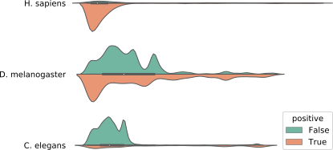

+++
template = "page.html"
title = "Use misassemblies to compare assembly without correction and polishing"
date = 2019-09-06
draft = true
tags = ["long-read", "assembly", "evaluation"]
+++

I think all the people who have ever done a genome assembly one day say: "Ok my assembly was cool, but now how I can be sure it's the best possible one and they didn't contain many errors ?"

We have many technics to evaluate the quality of assembly (isn't a complete review sorry):
- with only assembly information:
  + with [N50 family metrics](https://doi.org/10.1089/cmb.2017.0013)
  + analysis of read remapping against assembly [ASMOValidate](http://amos.sourceforge.net/wiki/index.php/Amosvalidate), [REAPR](https://www.sanger.ac.uk/science/tools/reapr), [FRCbam](https://github.com/vezzi/FRC_align), [Pilon](https://github.com/broadinstitute/pilon/wiki), [VALET](https://www.cbcb.umd.edu/software/valet)
  + by computing the probability of the reads dataset can be generate from the assembly ([ALE](https://doi.org/10.1093/bioinformatics/bts723), [CGAL](https://doi.org/10.1186/gb-2013-14-1-r8), [LAP](https://doi.org/10.1186/1756-0500-6-334))
- by using external information: 
  + count the number of core gene present in assembly, [BUSCO](https://busco.ezlab.org/)
  + transcriptome information, [for example, *Bos taurus* genome validation](https://doi.org/10.1186/gb-2009-10-4-r42)
  + synteny information [Lui et al](https://doi.org/10.1186/s12859-018-2026-4)
  + map assembly against a near genome, [quast](https://doi.org/10.1093/bioinformatics/btt086)
  + map assembly against the reference genome
  
If you use quast to reference genome, you have a reference genome, so why you want to perform an assembly?

The main case where we perform something like that was when we want to evaluate different assembly pipeline on the same read data set. To evaluate a completely new assembly pipeline, test a different set of parameters, evaluate the impact of add or change tools in an assembly pipeline.

Quast was a very useful tool and they integrate now many other assembly evaluating tools (BUSCO, [GeneMark](http://exon.gatech.edu/GeneMark/), [GlimmerHMM](https://doi.org/10.1093/bioinformatics/bth315), [barnap](https://github.com/tseemann/barrnap))

Recently, with Rayan Chikhi and Jean-Stéphane Varré, we publish a [preprint](https://www.biorxiv.org/content/10.1101/674036v2) about [yacrd](https://github.com/natir/yacrd/) and [fpa](https://github.com/natir/fpa), two standalone tools they can be introduced in assembly pipeline to remove very bad reads region and filter out low-quality overlap. We evaluate the effect of these tools on without correction long-reads assembly pipeline ([miniasm](https://github.com/lh3/miniasm) and [redbean](https://github.com/ruanjue/wtdbg2)) and compare the assembly quality of different pipeline with quast.

We send this paper to a journal, and a reviewer says something like that "quast isn't a good tool to evaluate high error assembly, the number of misassemblies was probably over evaluate." and it's probably true.

Miniasm and redbean perform an assembly without reads correction step (and without consensus step for miniasm). The low quality of the contigs sequence is a real problem quast could confuse a low-quality region misaligned with misassemblies.

In this blog post I want an answer the following questions:
1) how to run quast on long-read uncorrected misassemblies
2) is the quast misassemblies count a good tool to evaluate / compare assemblies?
3) can we find better metrics than just a number of misassemblies?

If you have no time to read all this long and technical details you can go directly to the [TL;DR](#take-home-message).

## Dataset, assembly pipeline, analysis pipeline her version and parameter

For our test we are going to use two Nanopore datasets and one Pacbio dataset.
- Reads:
  * [Oxford nanopore D melanogaster](https://www.ebi.ac.uk/ena/data/view/SRX3676783) 63x
  * [Oxford nanopore H sapiens chr1](http://s3.amazonaws.com/nanopore-human-wgs/chr1.sorted.bam) 29x
  * [Pacbio RS P6-C4 C elegans](http://datasets.pacb.com.s3.amazonaws.com/2014/c_elegans/list.html) 80x
- References:
  * [D. melanogaster](https://www.ncbi.nlm.nih.gov/assembly/GCF_000001215.4) 143.726002 Mb
  * [C. elegans](ftp://ftp.ensembl.org/pub/release-95/fasta/caenorhabditis_elegans/dna/Caenorhabditis_elegans.WBcel235.dna.toplevel.fa.gz) 100.2 Mb
  * [H. sapiens chr1](ftp://ftp.ensembl.org/pub/release-95/fasta/homo_sapiens/dna/Homo_sapiens.GRCh38.dna.chromosome.1.fa.gz) 248.9 Mb
  
To perform assembly we use minimap2 (version 2.16-r922) and miniasm (version 0.3-r179) with recommended preset for each sequencing technology (`ava-ont` and `ava-pb`).

We use [racon](https://github.com/lbcb-sci/racon) (v1.4.3), for mapping read against assembly we use minimap2, with recommended preset for each sequencing technology.

We use quast version v5.0.2.

All dotplot was produced by [D-Genies](http://dgenies.toulouse.inra.fr/).

## Quast misassemblies definition

What's a quast misassemblies? Did we have some different type? How they are defined? 

Quast define three type of misassemblies **relocation**, **translocation** and **inversion**.

### Relocation

A relocation can occur between two mappings of the same contigs against the same chromosome, we have two cases when these two mappings:
- is separated by a region without mapping (case **A**)
- cover the same region of the chromosome  (case **B**)

A misassembly was count when $L_x$ and $L_z$ > 1kbp (this value can't be change ?) and when $L_y$ > `extensive-mis-size` (1kbp by default).

We can call $L_y$ the length of the relocations, it's a part where assembly pipeline make an error we can quantify the length of this error. When it's a relocation where a part of the reference is missing in assembly (case **A**) this length is positive when it's a relocation where assembly contains a duplication of a region present one time in reference (case **B**) this length is negative.

A dotplot of contigs ctg000002L for our *C. elegans* miniasm assembly against the chromosome V, we can see two relocation events of type **B** circle in blue and a relocation event of type **A**, I have no idea to explain the other problem upper.

### Translocation

A translocation occurs when contig has mapping on more than one reference chromosomes.

Generally, it's easy to spot this type of misassemblies on dotplot, the contig has a match on two chromosomes.

A part utg16L from our *C. elegans* miniasm assembly, map on chromosome II and V of reference, these contigs contain a translocation without any doubt. 

### Inversion

An inversion occurs when contig has two consecutive mappings on the same chromosome but in different strands.

An inversion observes in dotplot of reference genome against miniasm assembly of *C. elegans*

The contig utg0000021L map on chromosome I but contig contains an inversion in begin.

### Important point

For more details on quast misassemblies definition, you can read this section [3.1.1](http://quast.bioinf.spbau.ru/manual.html#misassemblies) and section [3.1.2](http://quast.bioinf.spbau.ru/manual.html#sec3.1.2) of quast manual.

Quast base her misassemblies analysis by mapping contigs against a reference. To perform alignment recent version of quast use [minimap2](https://github.com/lh3/minimap2), with preset `-x asm20` [when min-identity is lower than 90%](https://github.com/ablab/quast/blob/b040cc9140c7630eea95f94cdda3b825cf4a22c3/quast_libs/ca_utils/align_contigs.py#L65). Alignment with identity lower than `min-identity` (95% by default, minimum 80%) are filtered by quast.

`min-identity` was a very important parameter, to have misassemblies we need to have at minimum two mappings for a contig. If the second mapping has an identity under than `min-identity` threshold quast can't observe this misassembly. But even more, if we take another case with three mappings if the mapping in middle was lowest than the `min-identity` threshold and if the gap creates between two other mappings is larger than `extensize-mis-size` quast can count misassembly, where it's, isn't a misassembly.

**`min-identity` and `extensize-mis-size` have an important impact on misassemblies detection what is the effect of the evolution of these two parametres on the number of misassemblies found by quast?**

## Effect of min-identity

### Low min-identity is required for uncorrected assembly

Quast uses mapping with alignment identity upper than `min-identity`, what is the good value of this parameter for long-read uncorrected assembly.

File `contigs_reports/minimap_output/{output-name}.coords` in the fourth column contains the mapping quality. For each dataset, we extract this value and plot in a histogram.

{{ plotly(id="mapping_identity", src="mapping_identity.js") }}

In the horizontal axis, we have the identity percent, in the vertical axis, we have the number of mappings in each bin.

The black line mark quast the default identity value threshold, we can see a majority of alignment was under this threshold for uncorrected dataset usage of `min-identity 80` seems necessary.

### Effect on a corrected dataset

To test the effect of correction on misassemblies count we run racon 3 times on *C. elegans* (the one with the best reference) dataset.

For not corrected assembly quast use 7049 mapping, for corrected assembly quast use 30931 (increasing ratio 4.38).

{{ plotly(id="c_elegans_map_id", src="c_elegans_map_id.js") }}

In the horizontal axis, we have the identity percent, in the vertical axis, we have the number of mappings in each bin.

We can observe an increase in mapping quality, a majority of mapping has an identity upper than 95 % compared to the uncorrected assembly.

To have an insight on the effect of mapping_identity on corrected assembly we run quast with default parameter on corrected (with racon) *C. elegans* dataset.

| racon | no | yes | yes |
| -| -| -| -|
| **min-identity** | **80** | **80** | **95** |
| relocation | 1131 | 886 | 635 |
| translocation | 200 | 259 | 170 |
| inversion | 65 | 68 | 75 |
| total | 1396 | 1213 | 880 |

With `min-identity 80` the number of relocation and translocation is increased compared to the default value of `min-identity`. If quast have only one alignment of a contig, quast can't found misassemblies, by reducing the `min-identity` we increase the number of alignment and mechanically increase the number of misassemblies.

Maybe some of these misassemblies aren't real misassemblies but if we use the same `min-identity` value for all assembly we want to compare. We can hope this number of fake misassemblies was the same in all conditions.

**For an uncorrected long-read misassemblies use the minimal identity threshold (80 %) was required**

## Effect of extensive-min-size on misassemblies count

We observe the `min-identity` parameter have a very important impact on the number of misassemblies and for uncorrected long-read assembly we need to set this parameter to 80 %. Now we want to observe what is the impact of `extensive-min-size` parameter.

We launch quast with different value for parameter `extensive-min-size` 1.000, 2.000, 3.000, 4.000, 5.000, 6.000, 7.000, 8.000, 9.000, 10.000, 20.000, 30.000, 40.000, 50.0000 the parameter `min-identity` was fix at 80 %.

{{ plotly(id="nb_breakpoint", src="nb_breakpoint.js") }}

In the horizontal axis, we have the `extensive-min-size` value in the vertical axis we have the number of misassemblies, you can click on the legend to show or hide an element.

This graph shows the evolution of the number of misassemblies in the function of the `extensive-min-size` value, after 10.000 the number of misassemblies becomes quite stable.

This graph shows two types of misassemblies some found with `extensive-min-size` lower than 10.000 and another where `extensive-min-size` are upper than 10.000. **This information was intresting but we know quast have three type of misassemblies and only relocation was affect by `extensive-min-size` parameter. How each type evolve when this parameter grow**

### Effect of extensive-min-size on each misassemblies types count

Quast defines three types of misassemblies **relocation**, **translocation** and **inversion** previously we observe the total number of misassemblies, how each group of misassembly evolves.

{{ plotly(id="misassemblies_type", src="misassemblies_type.js") }}

In the horizontal axis, we have the `extensive-min-size` value in the vertical axis, we have the number of misassemblies, you can click on the legend to show or hide an element.

For *H. sapiens* dataset didn't have any translocation because the reference was composed of only one chromosome, the majority of misassemblies were relocation but when we increase the parameter extensive-min-size the number of inversions was increasing.

*D. melanogaster* reference contains many small contigs this can explain the high number of translocation. Relocation and translocation drop at the same time. 

For *C. elegans* the number of translocations was quite stable, the number of relocations drops down rapidly and the inversion has a little increase.

I can't explain why translocation and inversion number change with a different value of `extensive-min-size`. By reading quast documentation and code I didn't understand the influence of this parameter on this group of misassemblies.

**Relocation misassemblies are the most common type of misassemblies and we can impute the reduction of misassemblies, when `extensive-min-size` grow up, to relocation misassemblies reduction.**

### Relocation length distribution

We see previously for our assemblies a majority of misassemblies were relocation we are now focused on this type of misassemblies. For each relocation we can attach a length, this length was the length of incongruence between assembly and reference genome, it's equal to $L_y$.

The file `{quast_output}/contigs_reports/all_alignements_{assembly_file_name}.tsv` contains information about mapping and misassemblies. For other information on how quast store mapping and misassemblies information read [quast faq](http://quast.bioinf.spbau.ru/manual.html#sec7).

In the horizontal axis, we have the log length of each relocation, in the vertical axis, we have the species, orange point for negative relocation, green point for positive relocation.

This figure shows a swarm plot of log of length associated to recombination it's the size of the gap between mapping border the misassemblies. If the length is positive assembly miss a part of the reference (green point) if the length is negative assembly duplicate a part of the reference (orange point), [source code](relocation_length.py), [data](relocation_length.csv) and data was available.

For *H. sapiens* majority of relocation was positive and short (between 1000 and 5000 base), with some very large relocation. For *C. elegans* it's different, the majority of relocation is negative and the largest relocation was shortest than *H. sapiens*. For *D. melanogaster* the size of relocations was more spread the majority of relocation isn't the shortest this confirmed by the appearance of the curve seen in the previous part when the `extensize-min-size` is increased, the number of relocations decreases less quickly than for the other datasets. 

**With this representation, we can analyze the difference between relocation distribution in term of the number of relocation and her length distribution.**

## Conclusion

If you work with quast to evaluate an uncorrected misassembly, you need to set `min-identity` parameter to 80 %. It would be nice to have a lower minimum value, maybe 70%, but the quast code would have to be modified. And this value is required only for miniasm assembly, for tools with a better consensus step (redbean for exemple) 80 % was suffisent.

The translocation and inversion was the minority of misassemblies but when they occure the are clearly a misassemblies. I would be very surprised to see a translocation or inversion created by a mapping error generated by errors in uncorrected reads. We can use the count of translocation and inversion.

For relocations, the majority of misassemblies in our case, some of them are *true* some of them are  *false*, check all misassemblies manualy is impossible, found the good `extensive-min-size` value seems very hard for me. The easiest think we can do is compare the series of length associate to relocation in this blogpost I use a swarmplot I think statisticien people could find better tools.

## Take home message

You can use quast to compare long-read uncorrected misassemblies but:
- run quast with `--min-identity 80`
- compare translocation and inversion count
- for relocation compare distribution of length associate to each misassemblies

## Acknowledgement

For their help in writing this blogpost:
- Rayan Chikhi
- Jean-Stéphane Varré
- Matthieu Falce
- Yoann Dufresne
- Antoine Limasset
